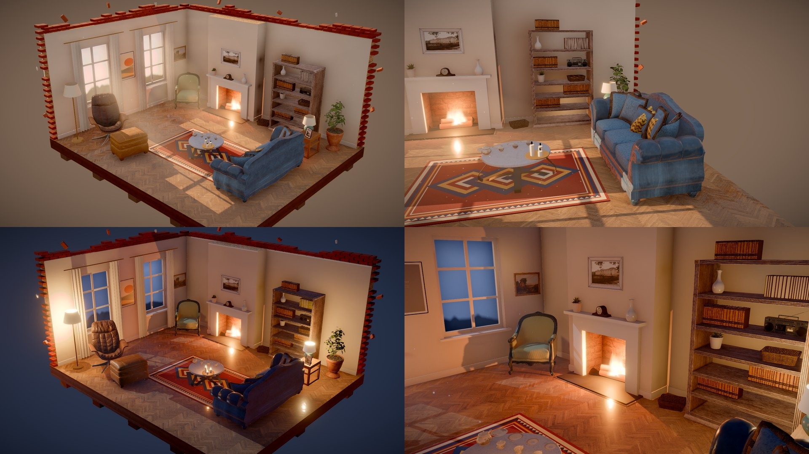

# Dustlight

A cozy room-restoration game that runs in the browser. Six abandoned places — a meadow
house, a lakeside cabin, an old bookshop, a pottery studio, a hilltop castle and a
neon-lit alley — wait to be cleaned up, repaired and decorated. There are no timers and
no scores. The point is the light: sun through a window you just wiped, the glow of a
fire you lit, the day turning to evening over a room you brought back.

Built with [three.js](https://threejs.org) and custom real-time global illumination
(a probe grid that re-bounces light as you change the room). Thai and English.



**Play it in the browser: <https://shinznatkid.github.io/dustlight/>** (a desktop browser with a mouse; the first place downloads about 25 MB)

## How to play

Each place starts as a mess with a checklist of repairs, followed by boxes of furniture
and decorations to unpack. Finish a place to open the next one.

| | |
|---|---|
| Right-drag · WASD / arrows · scroll | turn · move · zoom the camera |
| Left button | use the tool in your hand (pick one with `1`–`6`); floor tools keep working while you hold the button |
| Hand | click a thing to pick it up, click again to put it down · wheel = rotate 15°, `R` = 90°, `Esc` / right-click = cancel |
| Boxes | click a box to take out the next item · drag a box to move it · carry an item out of the room to pack it away |
| Right-click a lamp or the fire | switch it on / off |
| `Esc` | pause (settings, photo mode, back to the menu) |
| `P` | photo mode: slide the time of day, `Space` takes a picture |

Your progress saves in the browser by itself. Finished rooms go into the album, where you
can also watch a timelapse of how you did them.

## Run it locally

Needs Node.js 20.19+ and Python 3 (standard library only, used to download the assets).

```sh
npm ci
npm run assets   # once: downloads the models, textures, music and sounds into public/assets/ (not in git)
npm run dev      # http://127.0.0.1:5190/
npm run check    # lint + a quick build (run before sending changes)
npm run build    # the release build in dist/ (models compressed, only what the game loads)
```

The models, textures and audio are CC0 / CC-BY works by other people, so the repository
holds only the scripts that fetch them (`tools/fetch_*.py`).

## Project layout

- `src/main.js` — boot and wiring · `src/ui/` — the screens (menu, places, settings, photo mode, before/after, album, timelapse) · `src/world.js` — scene, lights, the GI loop
- `src/levels.js` → `src/levels/<id>.js` — each place's starting state, tasks, boxes and twist
- `src/rooms/<id>.js` — each room's shell, furniture, lamps and cameras
- `src/level.js` + `trash` / `floor` / `walls` / `grime` / `boxes` — the systems the tasks use
- `tools/` — asset downloads and the checks (screenshots, image diffs, full-level playthroughs, frame-time measurement)

The development guide (running the checks, URL flags, how the lighting is built) is in
[docs/dev.md](docs/dev.md), and what went wrong with the lighting and why in
[docs/lighting-notes.md](docs/lighting-notes.md) — both in Thai.

Every push to `main` builds the game and publishes it to GitHub Pages
([.github/workflows/deploy.yml](.github/workflows/deploy.yml)).

## License

The code is MIT — see [LICENSE](LICENSE). The models, textures, music and sounds keep
their own licenses (CC0 and CC-BY); the full list is in [CREDITS.md](CREDITS.md) and in the
game's Credits screen.
